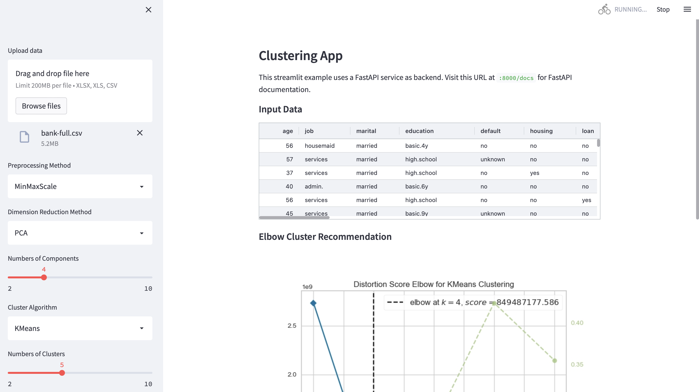
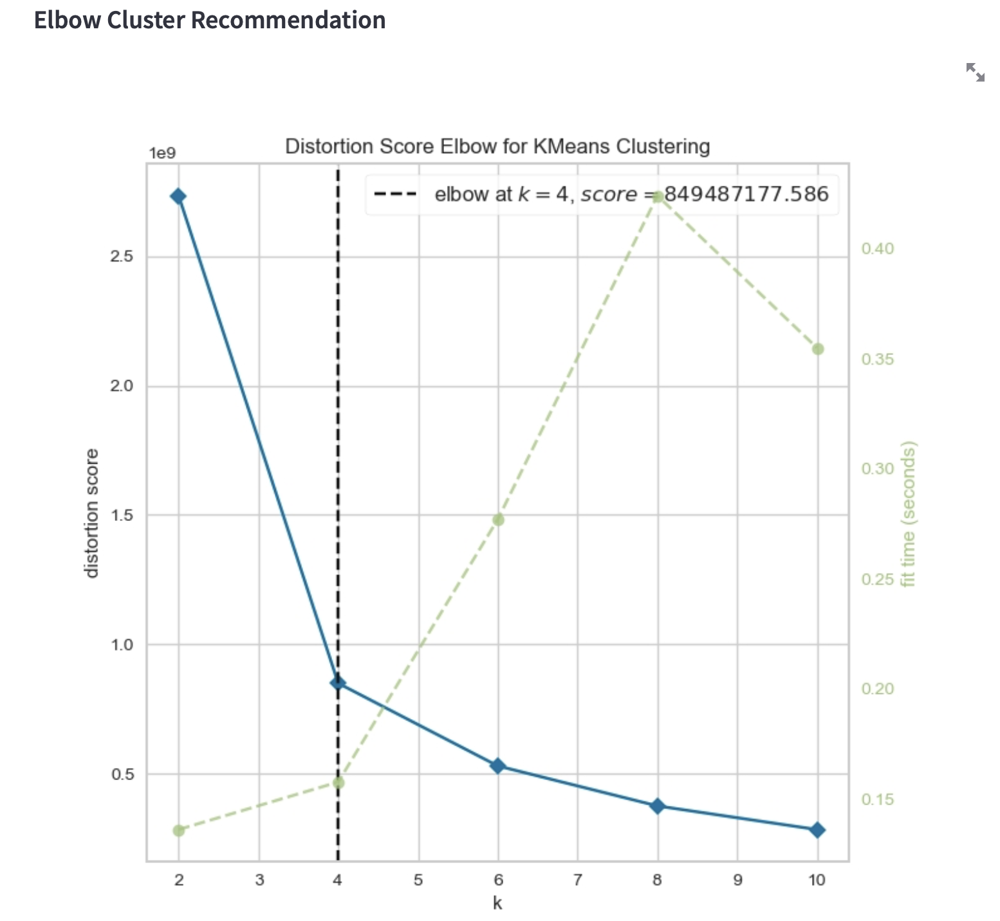
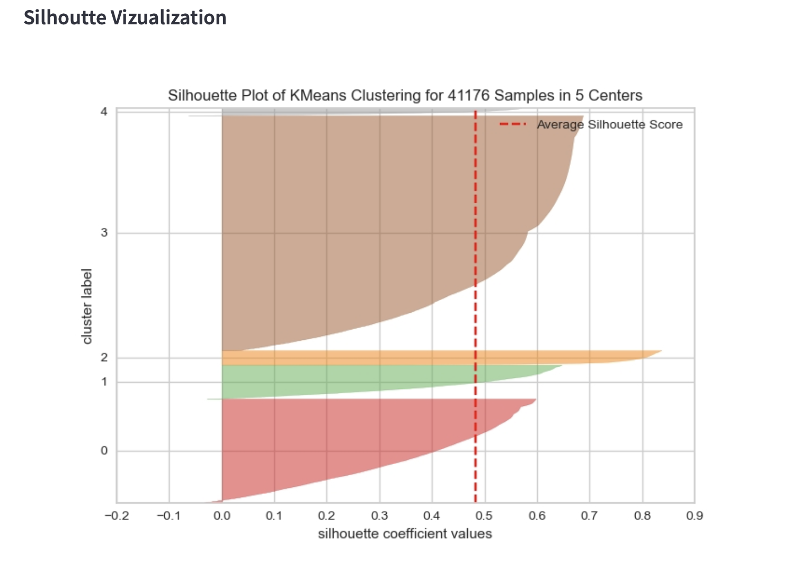
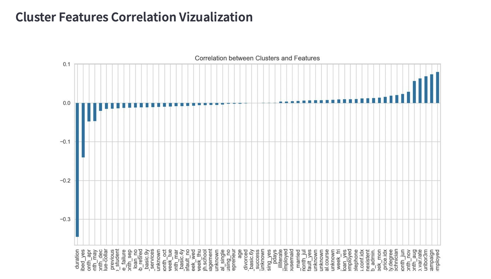
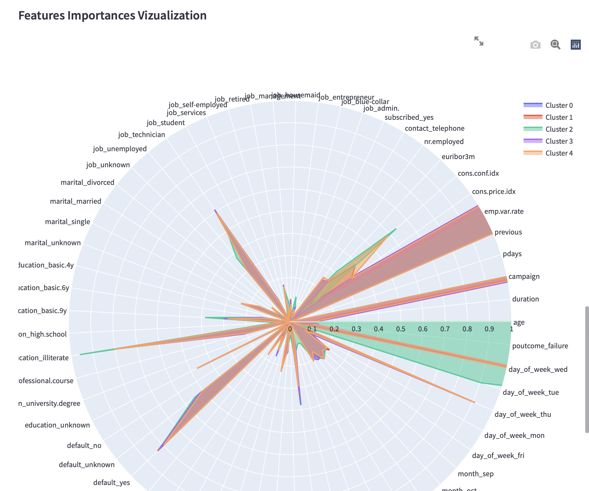
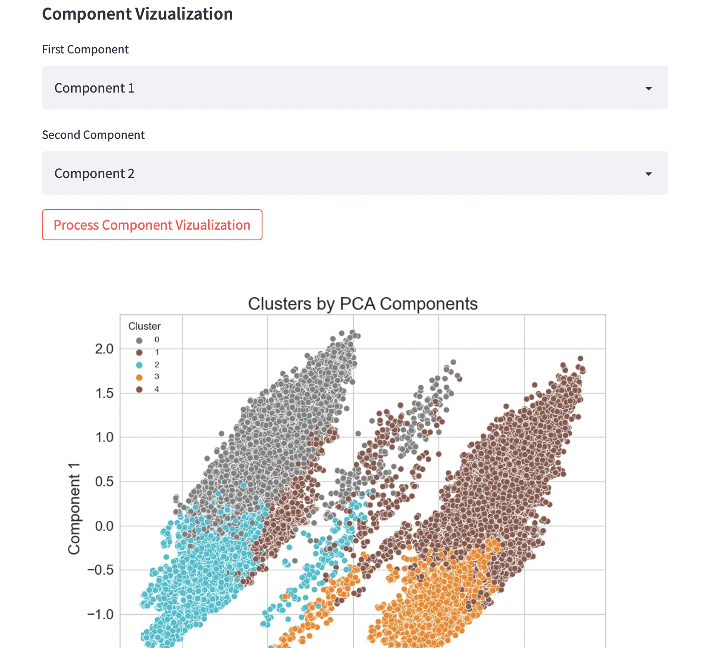
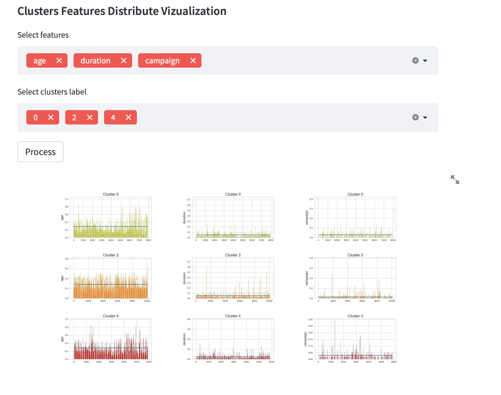

# **Customer segmentations**

## **Description**
Clustering demo tool for different data. 

For this app is using `FastAPI` for the backend service and `streamlit` for the frontend service. `docker-compose` orchestrates the two services and allows communication between them.

## **Setup**
To run the example in a machine running Docker and docker-compose, run:

    docker-compose build
    docker-compose up

To visit the FastAPI documentation of the resulting service, visit http://localhost:8000 with a web browser.  
To visit the streamlit UI, visit http://localhost:8501.

Logs can be inspected via:

    docker-compose logs

## **Available methods**:

### Preprocessing method:
- `MinMaxScale`
- `StandardScaler`

### Dimension reduction method:
- `PCA`
- `t-SNE`
- `LDA`

### Clustering algorithms:
- `KMeans`
- `MiniBatchKMeans`
- `SpectralClustering`
- `Birch`
- `AgglomerativeClustering`

## **Streamlit app view**

## **Vizualizations**
### Elbow Cluster Recommendation

### Silhoutte Vizualization

### Cluster Features Correlation Vizualization

### Features Importances Vizualization

### Component Vizualization

### Clusters Features Distribute Vizualization

